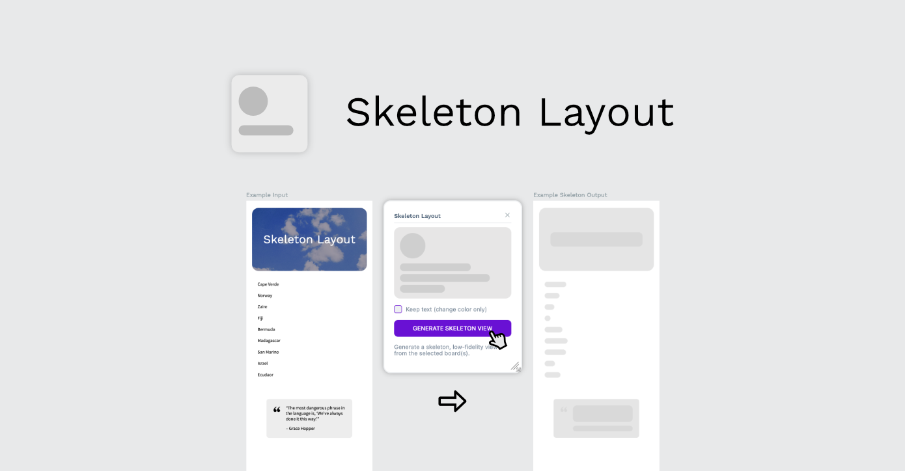

# Mockcharts Penpot Plugin

Create mockup charts and graphs for your Penpot designs

# Install on Penpot

Open the plugins modal in your Penpot project and add the next url

- https://penpot-mockcharts-plugin.netlify.app/manifest.json

Click install and you're setup! you can start creating different kinds of charts and graphs!
